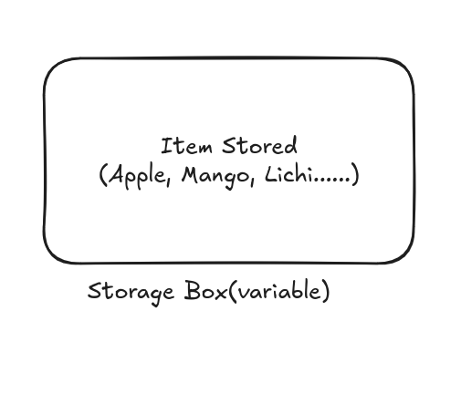
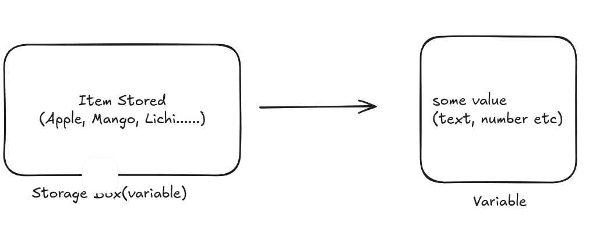
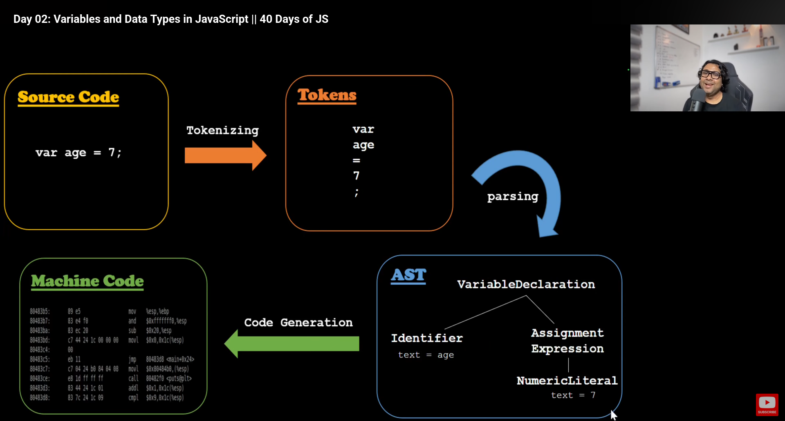

# Day: 2 Variables and Data Types

## Variables and Values
These are containers for data.

Consider variables as a box. In that box you can add anything you want. It can be a fruit, a vegetable, cloths or files.

What you put in that box (variable) is called a **value**.


There can be a need when I need to use the box(variable). For this you need to Identify it with a unique name.

We can say the name of the box is the name of the variable.

**Conclusion -**
Variables are storage boxes with a unique name with something (a value) inside it.


## Data Types
Variables are like boxes that store values.
The values stored in a computer can be different types, such as text (string), numbers (number), very large whole numbers (BigInt), or true/false values (boolean).
These different kinds of values are called data types.

**Data types in Javascript are of two types:**
1. *Primitive*: Primitive data types are Simple values that stores one single value, are not objects and cannot be changed(immuatable).
    a. Number - integers, decimals
    b. String - text
    c. boolean - true/false
    d. undefined - variable declared but not initialized.
    e. null - represents nothing
    f. bigInt - represents very large integer
    g. symbol - unique identifiers (symbol(id)) 

2. *Non-Primitive*: Non-primitive data types are complex values that can store multiple values are objects and can be changed 
    a. objects
    b. array
    c. functions

## variable declaraion keywords

1. var:
**Not used in modern Javascript apps**
- function scoped 
- can be redecalred 
- can be reassigned

``` js
var variable_name = value;
```

2. let
- block scoped 
- **cannot be** redeclared
- can be reassigned

``` js
let variable_name = value;
```

2. const
- block scoped
- **cannot be** redeclared
- **cannot be** reassigned

``` js
const variable_name = value;
```

## Variable Naming Convention
1. name must have digits or alphabets
2. can have $ and _
3. first character must not be a digit.
4. No reserved keyword.
5. use camelCase.
6. human readable.
7. name should match the cause.

## Storage of Data types

1. **Primitve** data data types are stored in **stack**.
2. **Non-primitive** data types are stored in **heap**.


## Javascript Code execution cycle



