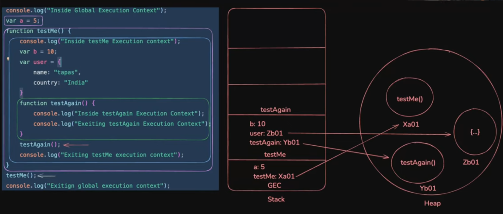

# Javascript Code Execution

- execution context
- lexical environment
- execution context.


## Global Execution Context - 
As soon as a js file is loaded in the website a globar execution context is created.
Anthing outside of a function is global.

Even if this JS file is completely free the global execution context provides us with two things
1. Window object.
2. **This** keyword.

This and window are both kind of an object right now and when we

```js
this === window;
```
it returns true meaning. Not only they have the same value they share a common source. That is in the heap we have all the values stored at some memory location meaning **this** and **window** point to the same memory location.

### Creation phase of global execution context.
It does not take place line by line. It scans the entire scope first. **First of all no matter if function invocation is encountered first and after the variable is defined first off all only memory allocation will take place.** After that only we move to next phase

1. Window object is available
2. this is available
3. window === this

```js
var name = 'tom';

function sayName(){
    console.log(this.name);
}
```

4. allocation of memory is done.
Primitive/Non-Primitive: Does not matter in creation stage will be initialized with undefined.
In case of functions the wholw function body is stored.

**for now**
```
name : undefined

sayName : (funciton body placed directly into memory) the content of sayName is stored in heap and in stack a refecne to that heap location is stored.
```

### Execution phase
1. All the variables are assigned thier value.
2. In the above piece of code we didn't invoke our function, hence only the step 1. will be done.

*only in the case when we have invoked our function a **function execution context** would have been created and the process similar to globar execution context would have worked.*


## Function Execution Context

```js
console.log("Inside global execution context")

var a = 5;

function testMe(){

    console.log("Inside testMe Execution context");

    var b = 10;
    var user = {
        name: "tapas",
        country : "India"
    };

    function testAgain(){
        console.log("Inside testAgain Execution Context");
        console.log("Exiting testAgain Execution Context");
    }

    testAgain();
    console.log("Exiting testMe Execution context");

}

testMe();
console.log("Exiting Global Execution Contest")
```





